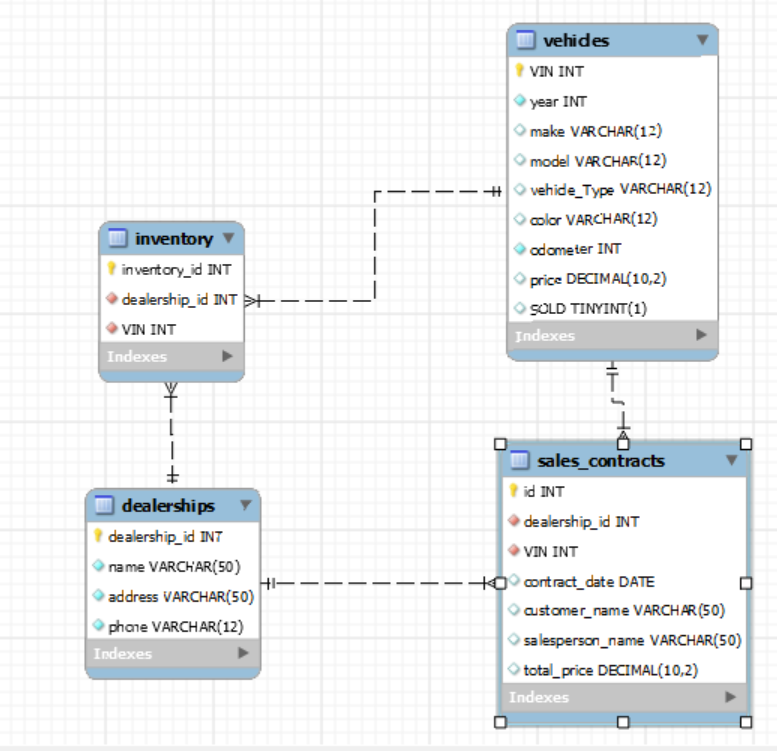

# CarDealershipDatabase

This script car_dealership SQL database allow you to re-run it multiple times and query specific items you wished to look up in the dealership database. This car dealership has four tables:

1. dealerships
2. vehicles
3. inventory
4. sales_contracts

## Database Diagram

